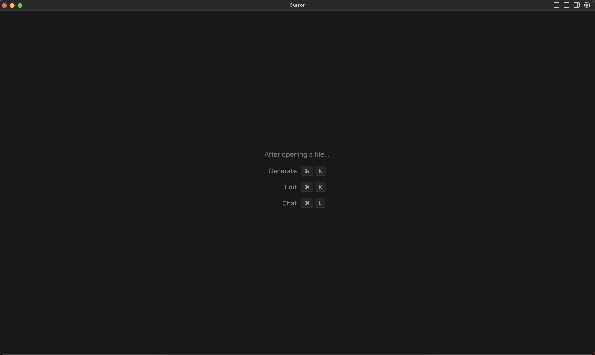

# Cursor 介绍与基础生成用法

## 实验介绍

Cursor 是一款与 OpenAI 合作并且基于 GPT-4 的新一代辅助编程神器，国内直接可以访问，它可以根据你的输入和需求自动生成代码片段，还可以帮助你重构、理解和优化代码，提高开发效率。在本节课程中，我们将介绍 Cursor 的基本使用方法。

#### 知识点

- Cursor 安装
- 代码生成
- 注释生成
- 测试用例生成

## 安装 Cursor

Cursor 官网地址：https://www.cursor.so/，当前支持 Mac 、Windows 和 Linux 操作系统。


Cursor 操作界面与 VSCode 类似：



同时 AIGC 功能也特别简单，只需要记住两个快捷键即可：

- Windows，Linux 平台：`Ctrl` + `K` 智能生成代码；`Ctrl` + `L` 进行对话。
- Mac 平台：`Command` + `K` 智能生成代码；`Command` + `L` 进行对话。

当前课程的演示，Cursor 版本为 0.2.2，接下来，我们将介绍基本的生成使用方法。

## 代码生成

代码生成属于最基本的功能，接下来让我们开始实践，首先创建一个空白文件，然后使用自然语言让 Cursor 生成一个 Python 的 mp4 读取函数。

```
generate a python mp4 reader function by OpenCV
```

<iframe 
    height=450 
    width=800 
    src="./1_Cursor.assets/mp4_reader_1.mp4" 
    frameborder=0 
    allowfullscreen>
</iframe>

Cursor 同样支持使用中文进行编程：

```
生成一个 Python 函数，用于读取 mp4，使用 OpenCV 库
```

<iframe 
    height=450 
    width=800 
    src="./1_Cursor.assets/mp4_reader_2.mp4" 
    frameborder=0 
    allowfullscreen>
</iframe>

因为在 GPT 训练语料中，英文语料的占比最高，因此使用英文生成的文本质量最好，在后续步骤中，我们将使用英文。

Cursor 当然也可以通过定义函数名来生成代码，以下例子是先定义 Python 快速排序的函数名与类型提示：

```
def quick_sort(array: list): -> list
```

<iframe 
    height=450 
    width=800 
    src="./1_Cursor.assets/quick_sort.mp4" 
    frameborder=0 
    allowfullscreen>
</iframe>

## 注释生成

除了代码生成，还可以让 Cursor 对你的代码生成注释，以下用例是让 Cursor 生成冒泡排序算法的注释、文档和类型提示：

```
generate comments, docstring and type hit

def bubble_sort(arr):
    n = len(arr)
    for i in range(n):
        for j in range(0, n-i-1):
            if arr[j] > arr[j+1]:
                arr[j], arr[j+1] = arr[j+1], arr[j]
    return arr
```

<iframe 
    height=450 
    width=800 
    src="./1_Cursor.assets/docstring_gen.mp4" 
    frameborder=0 
    allowfullscreen>
</iframe>

## 测试用例生成

除了代码和注释，Cursor 还可以辅助你生成代码的测试用例，同时可以指定测试方式，以下用例是让 Cursor 使用 unittest 生成冒泡排序的测试用例：

```
generate test script by using unittest for this function

def bubble_sort(arr):
    n = len(arr)
    for i in range(n):
        for j in range(0, n-i-1):
            if arr[j] > arr[j+1]:
                arr[j], arr[j+1] = arr[j+1], arr[j]
    return arr
```

<iframe 
    height=450 
    width=800 
    src="./1_Cursor.assets/gen_test.mp4" 
    frameborder=0 
    allowfullscreen>
</iframe>

如果觉得测试用例太少，还可以继续生成：

```
generate more test case
```

<iframe 
    height=450 
    width=800 
    src="./1_Cursor.assets/gen_more_test.mp4" 
    frameborder=0 
    allowfullscreen>
</iframe>

## 实验总结

本次实验中，我们详细介绍了 Cursor 的基本使用方法。我们学习了如何安装和配置 Cursor，以及如何使用 Cursor 进行代码生成、注释生成和测试用例生成。通过本实验，我们可以更好地理解和掌握 Cursor 的功能，从而提高编程效率和代码质量。

接下来，我们将介绍 Cursor 更高级的使用方法。