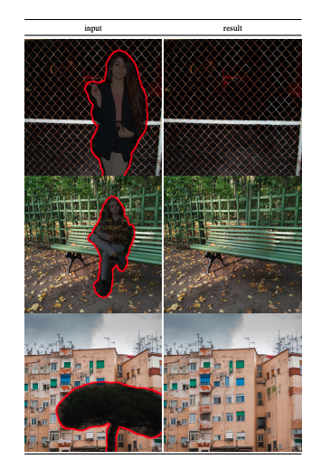

# AIGC 介绍

## 实验介绍

AIGC（Artificial Intelligence Generated Content）是指由人工智能算法生成的内容，这些算法通过学习大量的数据来模拟人类的思维和创造力，从而生成各种形式的内容，如文章、图像、视频等。在本节课程中，我们将介绍 AIGC 发展的历史，和目前知名的 AIGC 模型。

#### 知识点

- AIGC 发展历史
- AIGC 模型

## AIGC 发展历史

自 2022 年开始，AIGC 高速发展，这其中深度学习模型不断完善、开源模式的推动、大模型探索商业化的可能，成为 AIGC 发展的“加速度”。

AIGC 的应用范围非常广泛，可以用于自动化创作、内容生产、广告营销等领域，为人们提供更高效、更创新的解决方案。随着人工智能技术的不断发展，AIGC 将会成为未来内容创作的重要趋势之一。

学过李航老师编写的《统计学习方法》的同学都知道，在机器学习中，对于有监督学习可以将其分为两类模型：判别式模型和生成式模型，而 AIGC 对应的模型大多是生成式模型。

生成模型在人工智能领域有着悠久的历史，其中大家日常使用的输入法，其中包含的算法模型基本都是生成模型。

生成式模型的时间线，包括计算机视觉（CV），自然语言（NLP），视觉-语言（VL）领域

#### 传统机器学习时代

生成模型最早可以追溯到 1950 年代的隐马尔可夫模型（Hidden Markov Model，HMM）和高斯混合模型（Gaussian Mixture Model，GMM）。

在早期的生成模型中，不同领域总体上没有太多重叠。如在自然语言处理中，传统的句子生成方法是使用 N-gram 语言建模来学习单词分布，然后搜索最佳序列。但是，这种方法不能有效地适应长句子。

#### 神经网络时代

循环神经网络（Recurrent Neural Networks，RNN）的概念最初由研究人员 Paul Werbos 和 David Rumelhart 等人于 1980 年提出。RNN 允许建模相对较长的依赖关系。随后长短期记忆（Long Short-Term Memory，LSTM）和门控循环单元（Gate Recurrent Unit，GRU）的方法被提出，这些方法能够处理样本中的大约 200 个标记，与 N-gram 语言模型相比有了显著的改进。

2014 年，生成对抗网络（Generative Adversarial Nets，GANs）被提出，这是该领域的一个重要里程碑，GANs 可以被用于图像合成、图像修复、图像风格转换、超分辨率等各种应用。其中最令人瞩目的应用之一是生成高质量的逼真图像。

扩散模型早在 2015 年就被提出，扩散模型的主要思想是通过在训练数据上添加噪声，并在每个步骤中逐步减少噪声的方式来学习生成数据。这个过程可以看作是一个噪声水平从高到低的扩散过程。训练过程中，模型学习了如何在每个扩散步骤中去除噪声，从而逐步揭示出原始数据的结构。

#### Transformer 时代

生成模型在各个领域的进步遵循了不同的路径，但最终出现了交叉点：Transformer 架构。

Transformer 最早是由 Google 于 2017 年在《Attention is all you need》一文中提出，在论文中该模型主要是被用于克服机器翻译任务中传统网络训练时间过长，难以较好实现并行计算的问题。后来，由于该方法在语序特征的提取效果优于传统的 RNN、LSTM 而被逐渐应用至各个领域。

如在 NLP 领域，许多著名的大型语言模型，例如 BERT 和 GPT，都采用 Transformer 架构作为它们的主要网络结构，相较于以前的网络结构（如 LSTM 和 GRU），具有更好的性能。

在 CV 领域，Vision Transformer 和 Swin Transformer 通过将 Transformer 架构与视觉组件相结合，进一步采用了这一概念，使其能够应用于基于图像的下游任务。

CLIP 是一种联合视觉语言模型，它结合了 Transformer 架构和视觉组件，可以在大量文本和图像数据上进行训练。由于在预训练过程中结合了视觉和语言知识，它也可以用作多模态提示生成中的图像编码器。

2022 年 11 月底，人工智能对话聊天机器人 ChatGPT（Chat Generative Pre-trained Transformer）推出，ChatGPT 不单是聊天机器人，还能进行邮件撰写、翻译、写代码等任务。短短几个月时间，ChatGPT 在 2023 年 1 月份的月活跃用户数已达 1 亿，这使其成为史上用户数增长最快的消费者应用。

总之，基于 Transformer 的模型彻底改变了人工智能各项任务的范式，并使大规模模型和训练成为可能。

## 知名 AIGC 模型

接下来，我们将通过输出类型进行分类，依次介绍一些知名的 AIGC 模型。

根据输入和生成格式进行分类的生成模型

### 图像生成

以图像作为输出的模型。

#### 文本生成图像

以文本作为输入，以图像作为输出的模型，可应用于创意设计、艺术设计、纹理设计、服装设计、游戏设计和虚拟现实等场景。

- **DALL·E 2** ：由 OpenAI 创建，能够根据包含文本描述的提示生成原始、真实和逼真的图像和艺术
- **Stable Diffusion** ：由慕尼黑大学的 CompVis 小组开发，已开源。
- **MidJourney V5** ：2023 年 3 月登场，解决了一个技术难题和完成了一次跨越性的突破——画手。

通过描述，生成对应的图片

#### 图像生成图像

将输入图像转换为具有特定风格或特征的新图像的 AI 技术，适用于艺术创作、图像修复/编辑和设计领域。

- **Stable Diffusion IMG2IMG**：扩散模型家族中的一员，能够在消费级 GPU 上使用，在 10 秒级别时间生成图片，大大降低了落地门槛，也带来了文图生成领域的大火。

使用 IMG2IMG 进行抠图

## 视频生成

以视频作为输出的模型。

#### 图像生成视频

根据输入图像生成视频的 AI 技术，可用于广告制作、动画制作和电影特效等领域，也可以同时输入文本，通过文本限定输出视频的内容。

- **Phenaki**：该模型由 Google Research 开发，能够在给定一系列文本提示的情况下执行逼真的视频合成。

使用 Phenaki，输入一张猫咪照片和需要生成的文本描述，生成打哈欠的视频

#### 文本生成视频

以文本作为输入，以视频作为输出的模型，用于制作演示视频，广告培训材料等领域。

- **Make-A-Video**：Meta 公司（原 Facebook）在 2022 年 9 月推出，可以从给定的文字提示生成短视频。

<iframe 
    height=450 
    width=800 
    src="./AIGC.assets/make_a_video.mp4" 
    frameborder=0 
    allowfullscreen>
</iframe>

通过提示词“三马奔腾”，生成一段短视频

## 3D 形状生成

以 3D 形状生成作为输出的模型。

#### 文本生成 3D 形状

以文本作为输入，以 3D 形状作为输出的模型，可用于 3D 打印、建筑设计和动画制作等领域。

- **DreamFusion**：由 Google Research 开发的文本到 3D 模型，它使用预训练的 2D 文本到图像扩散模型来执行文本到 3D 合成。
- **Magic3D**：该模型是 NVIDIA 公司制作的文本转 3D 模型，相比之下 DreamFusion，在人类评估方面，该模型取得了更好的结果。

Magic3D 和 DreamFusion 的文本生成 3D 效果对比，Ours 指 Magic3D

#### 图像生成 3D 形状

将 2D 图像转换为 3D 模型的 AI 工具，可应用于游戏设计、建筑设计、地理信息系统、动画制作和产品原型开发等领域。

- **GET3D**：NVIDIA 于 2022 年 9 月发布的模型，可以通过 2D 图像训练，生成具有高保真纹理和复杂几何细节的 3D 形状。
- **pix2pix3D**：由卡内基梅隆大学朱俊彦团队发布，通过给定一个二维标签图（例分割图，轮廓图）、一个随机潜在代码和一个相机姿势作为输入，生成器会以相机姿势作为视角渲染标签图和图像。

<iframe 
    height=450 
    width=800 
    src="./AIGC.assets/pix_to_pix.mp4" 
    frameborder=0 
    allowfullscreen>
</iframe>

通过简笔画和分割图，pix2pix3D 生成 3D 图像

### 文本生成

以文本作为输出的模型。

#### 图像生成文本

通过分析图像内容生成描述性文本的 AI 模型，也可以同时输入文本，通过输入文本限定输出文本的内容，可用于图像标注、图片描述、无障碍应用、图文问答和图搜索引擎优化等场景。

- **BLIP-2**：由 Salesforce 研究院发布，支持一整套最先进的视觉语言模型。

使用 BLIP-2 进行图文问答

#### 文本生成文本

- **ChatGPT**：由 OpenAI 团队研发。最早 ChatGPT 的基底模型为 GPT-3.5，它上知天文下知地理，还能根据聊天的上下文进行互动。
- **GPT-4**：2023 年 3 月，多模态大模型 GPT-4 发布并整合到 ChatGPT 中，支持文本和图像输入，在字数上限和回答准确度等各方面实现了巨大提升。
- **New Bing**：接入 GPT 模型后的新一代搜索引擎，帮助用户搜索，直接显示搜索内容。
- **Brad**：Google 发布的大语言模型，对标 OpenAI 的 ChatGPT 系列。
- **LLaMA**：Meta 公司（原 Facebook）开源的大模型 LLaMa，对标 OpenAI 的 ChatGPT 系列。
- **Copilot** ：由 OpenAI 开发的一款面向程序员的 AI 代码助手，可以根据输入的文本描述生成代码，提高编程效率。

通过 ChatGPT 学习 Python

## 音频生成

以音频作为输出的模型。

#### 文本生成语音

将输入的文本转换为自然、流畅的语音，适用于语音助手、广播和有声书等场景。

- **AudioLM**：由 Google 开发，用于生成具有长期一致性的高质量音频。AudioLM 能够在给出简短提示的情况下生成自然且连贯的连续音。

#### 文本生成音乐

据用户的文本描述和需求生成独特的音乐作品。

- **Mubert**：通过真人谱曲、AI 组曲的方式，自动生成 12 种类型、永不间断的独特电子音乐。

## 实验总结

本节实验中我们了解了 AIGC 的发展历程与各个领域著名的 AIGC 模型。AIGC 的发展，让内容创建过程更加高效和易于访问，从而能够以更快的速度制作高质量的内容。

目前 AIGC 的发展非常迅速，在本课程制作过程中，AIGC 的技术更新频率依然是按月来计的，如果想要了解最前沿的咨讯，可以使用 RSS 订阅 [arXiv](https://arxiv.org/) 里面 cs.[CV|CL|LG|AI|NE]，stat.ML 领域，或者关注 GitHub 上的 [Trending](https://github.com/trending)、[Topics](https://github.com/topics) 栏目。

接下来，我们将通过一个免费使用的 AI 代码助手，了解如何通过 AIGC 来提高编程效率。