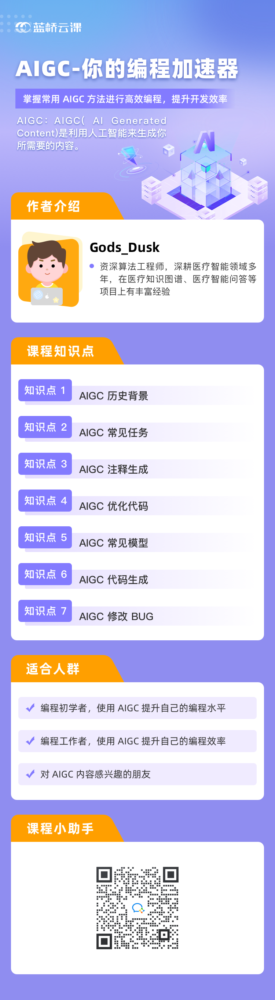

你将学到的

 AIGC 历史背景

AIGC 常见模型

 AIGC 常见任务

 AIGC 代码生成

 AIGC 注释生成

 AIGC 修改 BUG

 AIGC 优化代码

详细介绍

ChatGPT 的出现引领了一个新的概念——AI 生成内容（AIGC）。相比传统的 UGC、PGC 和 OGC，AIGC 的创作者不再是人类，而是人工智能。

学习 AIGC 的重要性不容忽视。随着人工智能技术的不断发展，AIGC 的应用场景不断扩大，涵盖了广告、媒体、娱乐、商业等多个领域。了解和掌握 AIGC 的原理和应用技术，将成为未来工作市场的重要竞争力。

此外，学习 AIGC 还可以帮助我们更好地了解人工智能对创意产业的影响和变革。在AIGC的创作中，人工智能将会替代一部分传统的创作工作，使得创作更高效、更快速、更智能化。同时，也需要人类从事更具创造性、更加高阶的创作工作，以应对未来工作的挑战。

学习 AIGC 对于我们未来的职业发展和产业变革至关重要，未来，AIGC 将会在更多的领域发挥作用，包括医疗、教育、金融等等。

本课程将先对 AIGC 发展历史进行概述，并介绍 AIGC 发展史上的重要事件，知名 AIGC 模型与其应用场景。然后本课程将介绍如何使用 AIGC 来提高编程效率，并给出具体使用 AIGC 生成代码的实践步骤。

### 效果展示

使用 Cursor 将 Python 代码转换为 C/C++ 代码：

<iframe 
    height=450 
    width=800 
    src="./README.assets/convert.mp4" 
    frameborder=0 
    allowfullscreen>
</iframe>

### 适合人群

- 编程初学者，使用 AIGC 提升自己的编程水平
- 编程工作者，使用 AIGC 提升自己的编程效率
- 对 AIGC 内容感兴趣的朋友